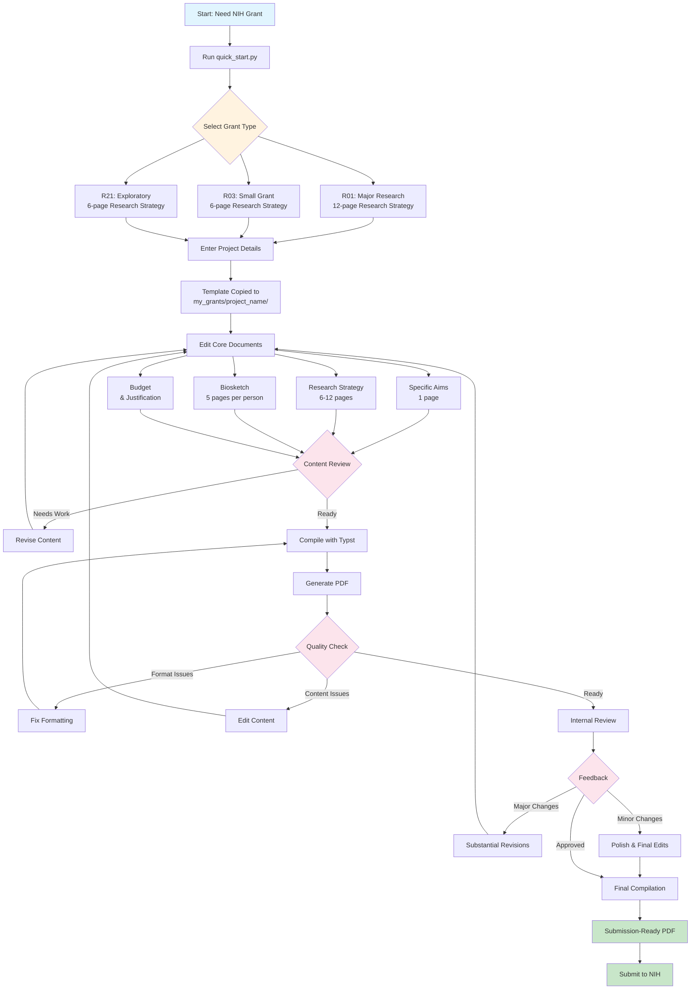

# NIH Grant Workflow: Template to Submission

## Workflow Phases

### 1. **Template Selection & Setup**
- Use `quick_start.py` for guided setup
- Choose appropriate grant mechanism (R01, R03, R21)
- Configure project details and folder structure

### 2. **Content Development**
- **Specific Aims**: Clear, testable hypotheses
- **Research Strategy**: Significance, innovation, approach
- **Biosketch**: Key personnel qualifications
- **Budget**: Detailed cost breakdown

### 3. **Review & Revision Cycles**
- **Content Review**: Scientific merit, clarity, feasibility
- **Format Check**: NIH guidelines compliance
- **Internal Review**: Institutional feedback

### 4. **Final Preparation**
- Polish language and presentation
- Ensure all requirements met
- Generate final submission PDF

## Key Checkpoints

| Phase | Checkpoint | Action Required |
|-------|------------|----------------|
| Setup | Template copied | Verify all files present |
| Development | First draft complete | Internal content review |
| Compilation | PDF generated | Format compliance check |
| Review | Feedback received | Address all comments |
| Submission | Final PDF | Upload to NIH system |

## Quality Gates

- ✅ **Page limits respected** (varies by grant type)
- ✅ **All required sections included**
- ✅ **References properly formatted**
- ✅ **Figures and tables clear and labeled**
- ✅ **Budget matches narrative**
- ✅ **Biosketches current and relevant**
